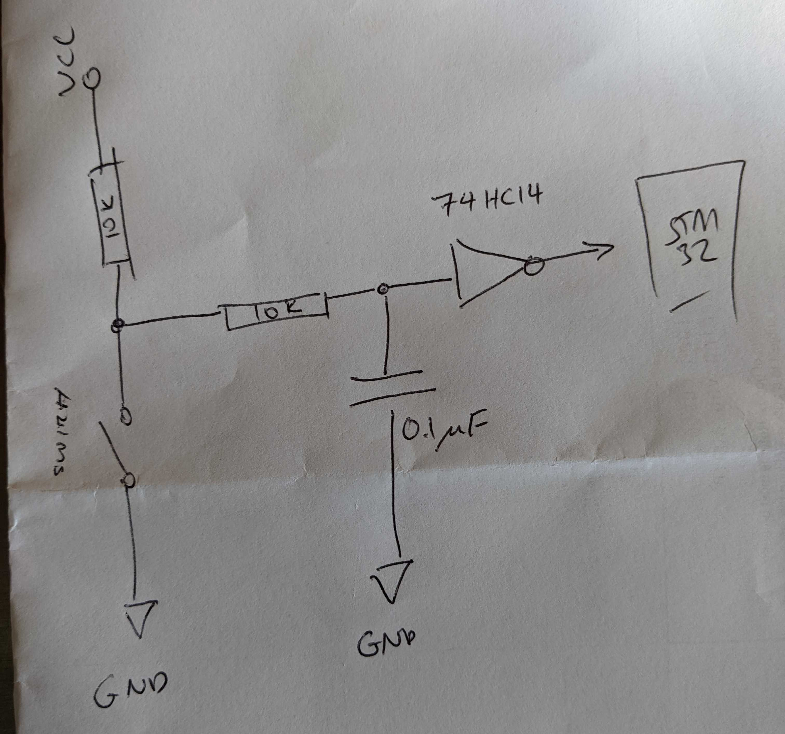

# morsdle
An implementation of Wordle, running on a STM32 where the input is a morse-key and the output is a 7-colour e-ink display.

I built this because I have an amateur radio licence and morse code seems to be the more fun way of getting something out of that hobby (who wants to actually /talk/ on the radio), but I am terrible at morse code and wanted a way to learn morse code but make it fun. This just continues a long list of silly "wordle related" projects I've made in the last 9 months since wordle took off.

# Dependencies:

## [ARM Development Toolchain](https://developer.arm.com/tools-and-software/open-source-software/developer-tools/gnu-toolchain/downloads-1)

You'll need to compile this for your platform (I am using a mac and it works fine)

## [OpenOCD](https://github.com/openocd-org/openocd)

Used by the cmake scripts to flash and debug (using gdb), you'll need to compile this for your platform yourself

## Other
There are copies of some libraries as submodules in the lib directory, make sure to init those (I don't use the HAL or CMSIS from CubeMX, but use the submodule version).

# Parts:

## Core
* [STM32L476RG (NUCLEO-L476RG)](https://au.element14.com/stmicroelectronics/nucleo-l476rg/dev-board-arduino-mbed-nucleo/dp/2493816)
* [Waveshare 5.56" 7-colour e-ink display](https://www.waveshare.com/wiki/5.65inch_e-Paper_Module_(F))
* [32 Mb NOR Flash (QSpi)](https://au.element14.com/digilent/410-340/pmod-board-32-mb-serial-nor-flash/dp/2726218) -- Ideally wouldnt have used this, but getting flash is next to IMPOSSIBLE at the moment in Australia.

## Hardware Debounce:
* [74HC14 (Inverting Schmitt Trigger)](https://au.element14.com/texas-instruments/sn74hc14dr/hex-schmitt-trigger-inverter-smd/dp/9594566?st=74hc14)
* 0.1 uF Cap
* 10k resistors (2)
* [SPDT (long lever) switch](https://au.element14.com/multicomp/m141t02-ad0302d/microswitch-spdt-10a-long-lever/dp/1735359)
* Breadboard (one day I will make a PCB for it)

(sorry for the poor quality sketch)

## Total Cost
I'd estimate around $150 AUD, with the display ~ $70 and the STM32 ~ $40 of that

# Pinout:

Can be changed by opening the .ioc file in the ioc directory and re-generating the code, but this is what I have configured:

## To Waveshare Display:
Using the SPI2 on the STM32L476 board (pin collision for SPI1..?)

* Vcc	- 3.3V  (light purple)
* GND	- GND  (brown/maroon)
* DIN	-  (MOSI2)  (dark blue)
* CLK	- (SCK2)  (yellow)
* CS	- (GPIOC9) (orange)
* DC	- (GPIOC7)  (green)
* RST	- (GPIOC8)  (white)
* BUSY - (GPIOC6)  (dark purple)

## To switch
* GPIOA12 (from the output of the 74HC14)

## To Flash Storage
* GPIOB0 - QSPI line 1
* GPIOB1 - QSPI line 0
* GPIOB10 - QSPI CLK
* GPIOB11 - QSPI NCS
* GPIOA6 - QSPI Line 2
* GPIOA7 - QSPI Line 3

## To UART
* GPIOA0 - UART-TX
* GPIOA1 - UART-RX

## "game mode" and "loader mode":
* Add 3.3v to GPIOC1 and reset the board, will then accept commands via UART to write words and fonts into the flash memory

# General Notes

* To build the STM code for a STM32 Nucleo-64 (STM32L476RG) specify the following command line arguments to cmake:
`-DSTM32_TOOLCHAIN_PATH={gcc-arm-path}/gcc-arm -DCMAKE_TOOLCHAIN_FILE=$CMakeProjectDir$/cmake/stm32_gcc.cmake`
* The waveshare display is awesome, but has a really long render time making the game kinda slow to play, but given you need some "thinking time" with wordle, it's probably not the end of the world
* The STM32L476 has very limited RAM so whilst the waveshare display supports 7 colours I have had to do some dodgy bit-smashing to only use four colours (black, white, green and orange) to be able to keep an imagebuffer in ram for rendering
* The waveshare display apparently supports updating a "region" of the display, rather than re-rendering the whole display - this is why the code is designed around a "bounding box" and render passes, but I haven't managed to get it working IRL, so at the moment it still renders the whole screen each time.
* The  morse code input uses a fixed "dit" time of 75 ms, which is a touch slow (or fast) depening on how comfortable you are with morse code, eventually I will either add a pot to the design to allow this time to be changed, or work out a different algorithm for making the timing more "adaptive" to the user
* There is no spell checking or "valid entry" checking at the moment, scanning through all the words even in flash seems like a waste, a smarter data structure (ternary tree) would probbaly allow this to happen
* The morse code input is relatively efficient for what is a linear scan (it's subdivided by the number of dots/dashes), but a binary tree would probably be even faster to implement
* You can enter letters while the screen is displaying (although it is jarring to do so), probably need to move "rendering" into a background thread (but don't want to use FreeRTOS, but building a simple scheduler should be doable)

# Things to do in the future

* Add the game configuration settings into the flash as well (short hold vs. long hold behaviour), rendering mode etc.
* Fonts at the moment are hard coded into the fonts.c file as uint8_t arrays, but should be loaded from the flash the same as the dictionary
